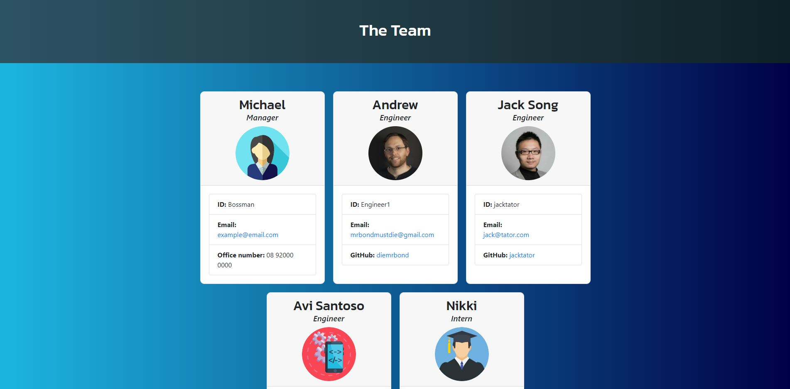

# Team Generator

## Description 
  This app will allow you to create a team member summary page, just by answering some simple question prompts. Using the inquirer package, you can setup your team quickly and easily. The app will verify the email address are valid via API call, and will check if the github account exists and retrieve the Avatar for Engineers. 

  Package requirements:
  1. Inquirer
  2. Jest
  3. Axios
  4. Email-verifier
  5. Log-symbols
  6. Ora
  7. Util

 

    

    

## Demonstration
  https://www.youtube.com/watch?v=9oKmExfKf_s

  ---
  ## Table of Contents

  * [Installation](#installation)
  * [Usage](#usage)
  * [Contributing](#contributing)
  * [Tests](#tests)
  * [Credits](#credits)
  * [License](#license)
  * [Questions](#questions)

  ---
  ## Installation 
  1. Using git bash (or equivalent) type `git clone https://github.com/diemrbond/TeamGenerator.git` 
  2. Change into the new directory by typing `cd TeamGenerator` 
  3. Type `npm install`

  
  ---
  ## Usage 
  To use this app, from git bash (or equivalent) type `node app.js` and follow the onscreen instructions.
  Then open the output/team.html file to view your team.

  
  ---
  ## Contributing 
  If you would like to collaborate on this project, please send a pull-request or follow my contact details to get in touch.

  
  ---
  ## Tests 
Tests have been included, which show that the Classes all function correctly.
Use `npm run test` to check results.

  ---
  ## Credits 
Thanks to the following for contributing to this project: 

Andrew Kelleher 

  ---
  ## License 
  This application is licensed under: MIT License
  
Copyright (c) Andrew Kelleher

Permission is hereby granted, free of charge, to any person obtaining a copy of this software and associated documentation files (the "Software"), to deal in the Software without restriction, including without limitation the rights to use, copy, modify, merge, publish, distribute, sublicense, and/or sell copies of the Software, and to permit persons to whom the Software is furnished to do so, subject to the following conditions:

The above copyright notice and this permission notice shall be included in all copies or substantial portions of the Software.

THE SOFTWARE IS PROVIDED "AS IS", WITHOUT WARRANTY OF ANY KIND, EXPRESS OR IMPLIED, INCLUDING BUT NOT LIMITED TO THE WARRANTIES OF MERCHANTABILITY, FITNESS FOR A PARTICULAR PURPOSE AND NONINFRINGEMENT. IN NO EVENT SHALL THE AUTHORS OR COPYRIGHT HOLDERS BE LIABLE FOR ANY CLAIM, DAMAGES OR OTHER LIABILITY, WHETHER IN AN ACTION OF CONTRACT, TORT OR OTHERWISE, ARISING FROM, OUT OF OR IN CONNECTION WITH THE SOFTWARE OR THE USE OR OTHER DEALINGS IN THE SOFTWARE.

  
  ---
  ## Questions
  If you have any questions about this project, please feel free to contact me via the following information:

  

  Andrew Kelleher

  Github: https://github.com/diemrbond

  Email: [mrbondmustdie@gmail.com](mailto:mrbondmustdie@gmail.com)

  ---
  © 2020 Andrew Kelleher | diemrbond.github.io
